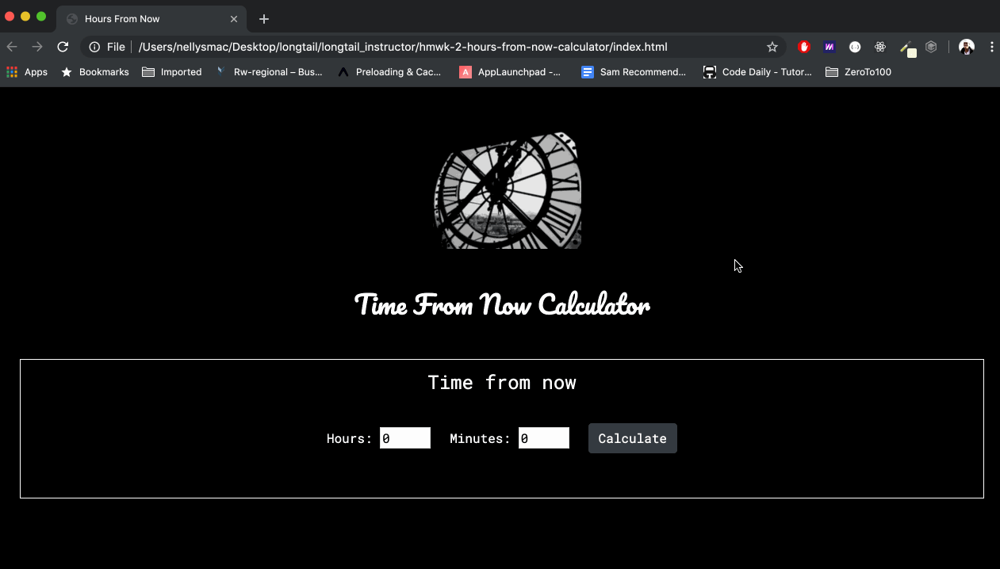
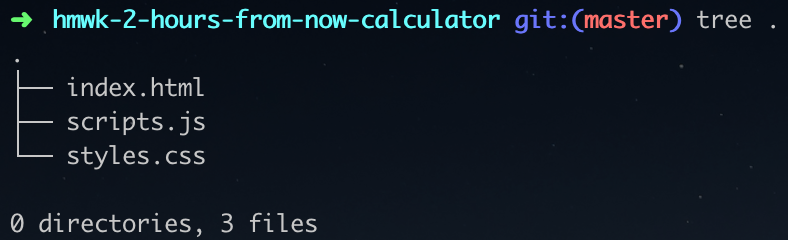
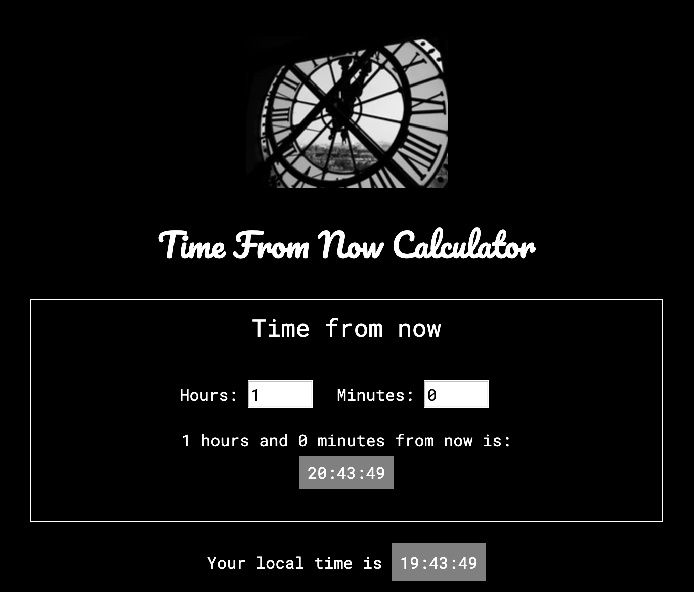
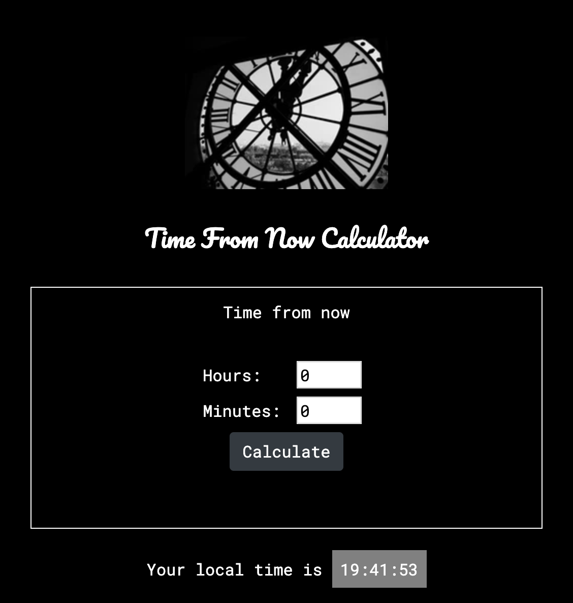
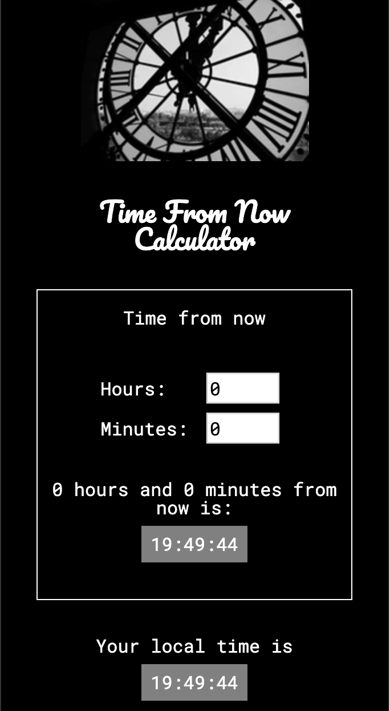

# Homework 2: Build a "time from now" calculator page

## Overview
Before this week, all you could be build were static web pages with no user interactivity. All you knew before this week was HTML and CSS.

This week, you added Javascript to your web development languages toolbox. You now know how to add user interactivity to your web pages. You've learned about creating and using variables, conditionals, loops, arrays, and functions in Javascript. You now know of the power of Javascript that makes it more than just a scripting language: manipulating the DOM. You also know about jQuery and how it makes manipulating the DOM with Javascript easier with the `$()` function. You've seen and practiced how to handle events with jQuery as well, which is at the heart of making a web page interactive.

```During this homework, you will put all this knowledge together to build a web page that will tell your users their local time and allow them to calculate any time from then by entering any number of hours and/or minutes to use.``` 

In this homework, you will also use [Moment.js library](https://momentjs.com/) to help you manipulate time data

## Page overview
NOTE: This overview outlines the minimum requirements. When you have met the requirements and still have time, you are encouraged to go above and beyond with your creativity and make this portfolio as unique to you as you can. For example, you can use different background colors of your liking by using [RapidTables](https://www.rapidtables.com/web/color/html-color-codes.html) or Chrome extensions like [ColorZilla](https://chrome.google.com/webstore/detail/colorzilla/bhlhnicpbhignbdhedgjhgdocnmhomnp?hl=en) to pick any color off your favorite websites. Likewise, feel free to get creative with your fonts by using any font of your liking from places like [Google Fonts](https://fonts.google.com/)

As shown in the gif below, your "time from  now" calculator page will:
* Always show the user's current local time. 
* When the user inputs a number of hours and/or minutes, your page will add those inputs to their current local time and show them what time it will be from their local time (when the new time goes past a day and/or year, your page will also show that to your user).
* At first, you will give your user a button to click for your page to calculate the new time from their current local time. But after, as soon as your user enters new input(s), your page will automatically calculate the new time from your user's current local time.



As shown in the screenshots in the *`styles.css`* section below, use a combination of CSS Flexbox and media queries to make your page responsive to different screen sizes.

## Instructions

1. File structure
* On Github, create a new repository and name it `hmwk-2-time-from-now-calculator`

* Using the terminal, navigate to where you want to save your homework 2 and `git clone` your newly create repository there. This will create a new directory on your computer with the name `hmwk-2-time-from-now-calculator`

* Using the terminal, `cd` into your `hmwk-2-time-from-now-calculator` directory

* Using the terminal, create 3 files inside of your new homework directory and name them `index.html`, `styles.css`, and `scripts.js` in which you will write your portfolio page HTML, CSS, and Javascript

When you are done, your file structure should look like the picture below 


2. Page layout
- *`index.html`*
    * In the `<head></head>`:
        - Remember to link to Bootstrap CSS as specified [here](https://getbootstrap.com/docs/4.3/getting-started/introduction/)
        - Remember to link to your `styles.css` stylesheet using the `<link/>` tag
        - Remember to link to any third party font if you are using any
        - Remember to give a `<title></title>` to your page

    * In the `<body></body>`:
        - Create a `div#header-image` to hold a header image
            - In the `#header-image` div, create and `img` tag with an online url source. Use any time related image you want. You can use resources like [Unsplash](https://unsplash.com/) to find free high quality images to use

        - Create an `h2#header-title` with the title of `Time From Now Calculator`

        - Create a `div#time-container` to hold everything else.
            - In your `styles.css`, remember to use CSS Flexbox to both center this `div#time-container` horizontally and to arrange its content vertically. 
                - HINT: Remember that one way of achieving this is to wrap the content of this div in one div (for example `div#inner-container`), using Flexbox to arrange the content of `div#inner-container` vertically and centering the content of `div#time-container` horizontally

            - Inside of `div#inner-container`, create 2 divs with ids: `#inputs-container` and `#local-time-container`. 
                - The `#inputs-container` div will hold the `Time from now` title and the form with your hours and minutes inputs (`#input-hours` and `#input-mins` respectively), the calculate button, and the jQuery dynamically calculated time-from-now results
                    - Remember to give ids to your calculate button and the div in which you want to put the dynamically calculated time-from-now results so that you can use jQuery to select them.

                - The `#local-time-container` div will hold the user's current local time dynamically calculated using jQuery

        - Before closing of your `</body>`, remember:
            - To include your `scripts.js` using the `<script>` tag
            - To include Bootstrap JS as specified [here](https://getbootstrap.com/docs/4.3/getting-started/introduction/)
            - To include Moment.js CDN `<script src=" https://cdn.jsdelivr.net/npm/moment@2.24.0/moment.min.js "></script>`
            - That if you forget to include the jQuery script, you will get errors like the `$` is not defined

- *`styles.css`*
    * Use this [CSS Reset](https://meyerweb.com/eric/tools/css/reset/) to normalize your CSS

    * Media queries breakpoints
        - `max-width: 710px`
            * Arrange the calculated time-from-now text content vertically as shown in the screenshot below

            
        
        - `max-width: 568px`
            * Arrange the hours, minutes inputs and the calculate button vertically as shown in the screenshot below

            

        - `max-width: 342px`
            * Arrange the calculated user current local time content vertically as shown in the screenshot below

            

- *`scripts.js`*
    * Use jQuery `$(document).ready(function(){})` at the top of your file and write your js code inside the `{}` to make sure that your code only executes after the DOM is ready.

    * STEP 1: Use Javascript `setInterval` function to get the user local time every second and use jQuery to dynamically populate `div#local-time-container` with the local time
        - Create a function named `createLocalTimeElement` that uses jQuery to dynamically create and return an HTML `<p></p>` element that holds the structure of the user local time: `<p id='local-time-text'>Your local time is: <span id='local-time-calculated' class='calculated-time'></span></p>`

        - Call `createLocalTimeElement()` and store its return value in a `localTimeElement` variable

        - Use Javascript `setInterval`, `moment.js`, and jQuery to get the user current local time every second, insert it in `span#local-time-calculated` of the dynamically created `localTimeElement` and insert the dynamically created `localTimeElement` into the `div#local-time-container` you created in your `index.html`

    * STEP 2: Use the jQuery `$(yourIdOrClass).on('yourEvent', function(){})` `click` event handler on the calculate button or `submit` event handler on your form to grab the user's inputs in the hours and minutes inputs when the user clicks the `Calculate` button and use Moment.js to add the user inputs to their current local time to get the time-from-now, use jQuery to dynamically create an element with the calculated time-from-now value and insert it in the div you prepared in your HTML
        - Create a function name `createCalculatedTimeFromNowElement` and inside of it: 
            - Use jQuery to get the values in `#input-hours` and `#input-mins` and save them in 2 variables (remember that `.val()` jQuery function returns a string, so cast their values to `Number` using Javascript)
            
            - Use Moment.js to get the user current local time and add the hours and minutes input values

            - Use jQuery to dynamically create and return an HTML `<p></p>` element that holds the structure of the calculated time-from-now: `<p id='calculated-time-from-now-text'>{INPUT_HOURS} hours and {INPUT_MINS} mins from now is:<span id='time-from-now-calculated' class='calculated-time'>{CALCULATED_TIME_FROM_NOW}</span></p>` where `{INPUT_HOURS}` and `{INPUT_MINS}` are the values of the user hours and minutes inputs respectively and the `{CALCULATED_TIME_FROM_NOW}` the time-from-now value calculated using Moment.js

    * STEP 3: After you get the local time and the time-from-now to show up on the page, start thinking about formatting them to match the page overview above
        - Your times should be in a 24hrs format: `hh:mm:ss`
        - If the time-from-now goes over 1 day, your calculated time should be in the following format: `hh:mm:ss +D days` where D is the number of days
        - If the time-from-now goes over 1 year, your calculated time should be in the following format: `hh:mm:ss +Y years` where Y is the number of years
        - If the time-from-now goes over 1 year and 1 day, your calculated time should be in the following format: `hh:mm:ss +Y and X days` where Y is the number of years and X is the number of days

    * STEP 4: BONUS (stretch goals when you have met the requirements and still have time):
        - Allow your users to choose whether they want to know the time from their local time either forward or backward.
        - Allow your users to choose between either a 24hr or 12hr format for their time

3. Deployment
Deploy your portfolio page to [Github pages](https://pages.github.com/) and submit your project link in the [`#hmwk-2-time-from-now-calculator-page-submissions` Slack channel](https://app.slack.com/client/TLKSMB8R4/CMY9QDHDW)

4. HAVE FUN AND HELP EACH OTHER OUT!