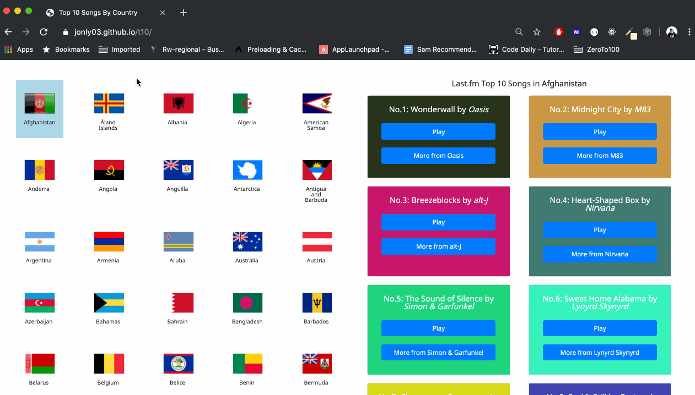

# Homework 3: Build a "top 10 songs by country" dynamic web page

## Overview
When first introducted to Javascript and jQuery, you could start building web pages with user interactivity. Your pages started being able to react to user inputs. But with the introduction of APIs and knowing how your web pages can connect to and use them using AJAX, you now know that web development is more exciting when your web pages are dynamic. 

```This week, you are going to put all you have learned (HTML, CSS, Bootstrap, Javascript, jQuery, AJAX, and APIs) to practice and build a cool web page that will show your users what the top 10 songs are in any country around the world!``` 

Everything you've learned until now is going to come together in this homework. To build this interactive and dynamic web page you will be using:
* HTML to structure your web page
* CSS styles and Bootstrap to style your web page
* CSS Flexbox and Media queries to make your web page responsive to changes of different screen sizes
* Variables, conditionals, loops, arrays, and functions in Javascript
* jQuery to select, manipulate, and dynamically create DOM elements
* jQuery to listen and handle user events
* AJAX calls to fetch/request APIs data


## Page overview
NOTE: This overview outlines the minimum requirements. When you have met the requirements and still have time, you are encouraged to go above and beyond with your creativity and make this top 10 songs by country page as unique to you as you can. For example, feel free to get creative with your fonts by using any font of your liking from places like [Google Fonts](https://fonts.google.com/)

As shown in the gif below, in this homework you are to build a page that gives your user a list of all countries in the world represented by their flags. When a country is selected/clicked, your page will show the user what the top 10 songs are in that selected country



## APIs to use
* [RESTCountries API](https://restcountries.eu/)
    - You will use this API to get all countries in the world with their country codes (aka `alpha2Code`) (for example BM for Bermuda)
    - No account creation necessary to use it
* [Country Flags: A simple API to load any flag]( https://www.countryflags.io/)
    - You will use this API to get country flags for countries you will get from the RESTCountries API above by using their `alpha2code`
    - This API will give you a `flat` flag image that you will use for a non-selected country and a `shiny` flag image that you will use for a selected country
    - No account creation necessary to use it
* [Last.fm API](https://www.last.fm/api/intro)
    - You will use this API to search for top songs by a country name you will get from the RESTCountries API above. 
    - You will have to format the country name you will get from the RESTCountries API before using it in this API (a function to do this is given to you in the `PROVIDED HELPER FUNCTIONS` section below)
    - You will need to create an account for this API to be able to use it

## Instructions
NOTE: Now that you are almost seasoned developers, these instructions and the ones for following homework and projects will be less specific. Instead of step by step instructions, they will give you general guides to get you going. This is for you to start exercising your problem solving skills will little to no guidance. You now know everything to make an awesome web page with little guidance.

1. File structure
    * On Github, create a new repository and name it `hmwk-3-top-10-songs-by-country`. Clone this repo to your computer and create .html, .css, and .js files for your page using the terminal

2. Page layout
    - **`index.html`**
        * In the `<head></head>`:
            - Remember to link to Bootstrap CSS as specified [here](https://getbootstrap.com/docs/4.3/getting-started/introduction/)
            - Remember to link to your `styles.css` stylesheet using the `<link/>` tag
            - Remember to link to any third party font if you are using any
            - Remember to give a `<title></title>` to your page

        * In the `<body></body>`:
            - You should have 2 divs: `#left` and `#right` 
                * The height of these divs should fill the height of the viewport height
                
                * The content of these divs should overflow and the divs should be scrollable

                * The left div should have a placeholder div to hold the countries and their flags you will dynamically get from the RESTCountries API (for example: `div#countries_container`)
                
                * The right div should have:
                    - A dynamic header title. The header title should be `Last.fm Top 10 Songs in COUNTRY` where `COUNTRY` is the dynamicly selected country
                    
                    - A placeholder div to hold the top 10 songs in the selected country you will dynamically get from the Last.fm API (for example `div#top_10_songs_container`)

            - You should style the selected country differently than other non-selected countries.
                * Use a shiny flag image from [Country Flags: A simple API to load any flag]( https://www.countryflags.io/) for selected countries and a flat flag image for the ones not selected

                * Give the selected country a border and a different background color to make it stand out.

                * Make the selected country stick to the viewport when the user is scrolling so that the user knows which country is currently selected (as shown in the page overview gif above). Read more about making an element stick [here](https://www.w3schools.com/howto/howto_css_sticky_element.asp)

            - Responsiveness
                * Follow the gif below to ensure that your web page is responsive to different screen sizes
                

                * HINTS:
                    * Worry about responsiveness only after you've finished building the whole page

                    * Use a combination of CSS Flexbox and media queries to achieve this

                    * At `max-width: 722px` make the flags container be above the top 10 songs container. Make sure to change which way the flags scroll.

            - Before closing of your `</body>`, remember:
                - To include your `scripts.js` using the `<script>` tag

                - To include jQuery CDN

    - **`styles.css`**
        * Use this [CSS Reset](https://meyerweb.com/eric/tools/css/reset/) to normalize your CSS


    - **`scripts.js`**
        * Use jQuery `$(document).ready(function(){})` at the top of your file and write your js code inside the `{}` to make sure that your code only executes after the DOM is ready.

        * Copy the functions in the `PROVIDED HELPER FUNCTIONS` section below in at the bottom of your file and make sure you understand what they do.

        * SUGGESTED STEPS:
            - **STEP 1: Show countries with their flags**
                1. Use the RESTCountries API to get a list of all countries

                2. For each country:
                    - Use its country code (`alpha2Code`) to get its flag flat image using the CountryFlags API

                    - Use jQuery to dynamically create a div with the country name and flag and insert it in your placeholder div that you created to hold the countries

            - **STEP 2: Handle selecting/clicking a country**
                1. Create a CSS class for a selected country (border, background-color, sticky etc) and initially add this class to the first country

                2. Use jQuery click handler (remember delegation) to remove the selected country class from the previously selected country and add it to the currently clicked country

                3. Use jQuery to get the name of the clicked country and dynamically change the header title of the `#right` div

                4. Figure out how to make the flag of the selected country shiny and otherwise flat

            - **STEP 3: Show top 10 songs in selected country**
                1. In the click handler get the name of the selected country

                2. Use the provided `getFormattedCountryName` helper function to format the selected country name

                3. Use Last.fm API to get the top 10 songs in the selected country

                    * Handle the case when the Last.fm API does not have any songs in the selected country as show in the page overview gif above

                    * Handle the case when the Last.fm API does have songs in the selected country:
                        - Use jQuery to dynamically create a div to hold all the songs in the selected country (for example: `div#top_10_songs_content`)

                        - For each song:
                            * Use jQuery to dynamically create a Bootstrap card with the song name, artist name as title (format: `Song name by Artist name`) and 2 buttons (one for song url and the other one for the artist url) as shown in the page overview gif above

                            * Use the provided `getRandomColor` helper function to assign each card a random background color

                            * Insert the song card in your `div#top_10_songs_content`

                        - Use jQuery to dynamical insert `div#top_10_songs_content` in your placeholder div that you created to hold the top 10 songs in the selected country

3. Deployment
Deploy your portfolio page to [Github pages](https://pages.github.com/) and submit your project link in the [`#homework-3-submissions` Slack channel](https://longtailschool.slack.com/messages/CPKU7S0BZ)


4. PROVIDED HELPER FUNCTIONS
```
function getFormattedCountryName(countryName) {
    // Gets a country name (from RESTCountries API)
    // Returns a country name formatted to match the expected format for the Last.fm API

    let newFormattedCountryName = countryName.trim();

    // Some countries have paranthesis. Remove them
    newFormattedCountryName = removeCharacters({
        string: newFormattedCountryName,
        charsToBeRemoved: '('
    })

    // Some countries have commas. Remove them
    newFormattedCountryName = removeCharacters({
        string: newFormattedCountryName,
        charsToBeRemoved: ','
    })

    // Some countries have "of". Remove them
    newFormattedCountryName = removeCharacters({
        string: newFormattedCountryName,
        charsToBeRemoved: "of"
    })

    // Replace spaces with + signs
    newFormattedCountryName = newFormattedCountryName.replace(/ /g, '+');

    return newFormattedCountryName;
}

function removeCharacters({
    string,
    charsToBeRemoved
}) {

    // Takes a string and characters to be removed
    // Returns a string without those characters

    let newString = string
    const charsToBeRemovedIdx = newString.indexOf(charsToBeRemoved);

    if (charsToBeRemovedIdx !== -1) {
        newString = newString.substring(0, charsToBeRemovedIdx)
    }

    return newString.trim();
}

// Copied from https://stackoverflow.com/questions/1484506/random-color-generator
function getRandomColor() {
    // Generates a random hex color and returns it

    var letters = '0123456789ABCDEF';
    var color = '#';
    for (var i = 0; i < 6; i++) {
        color += letters[Math.floor(Math.random() * 16)];
    }
    return color;
}
```

5. HAVE FUN AND HELP EACH OTHER OUT!